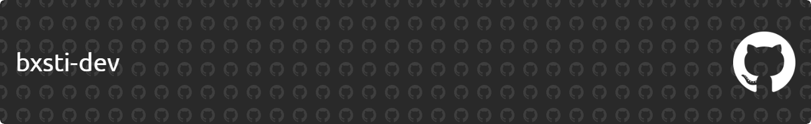

<h1 align="center">Hi 👋, I'm bxsti-dev</h1>

<h3 align="left">Languages and Tools:</h3>

 

<figure><embed src="https://wakatime.com/share/@Basti/272ca2cc-a6f0-481a-b11b-3b4e547edd3c.svg"></embed></figure>

 
 

